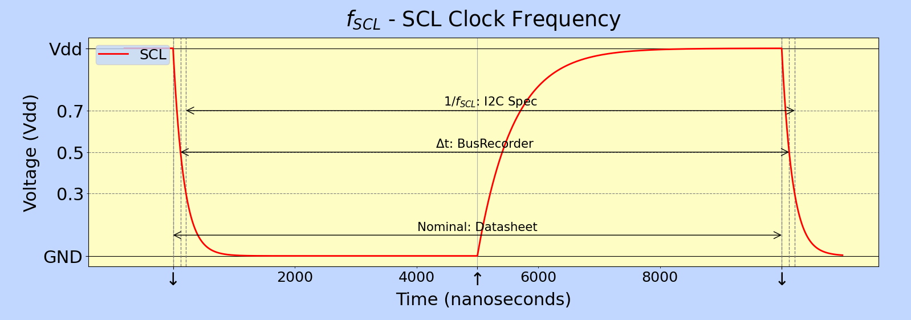
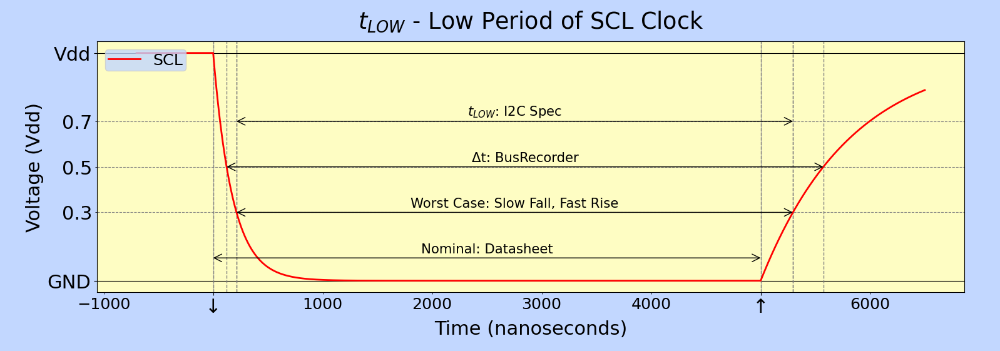
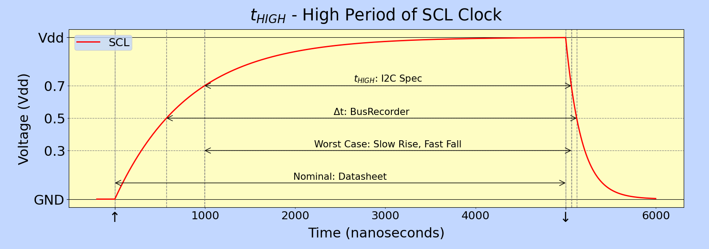
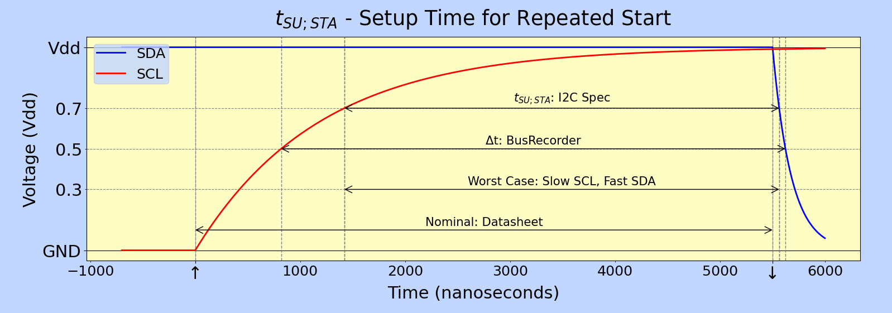
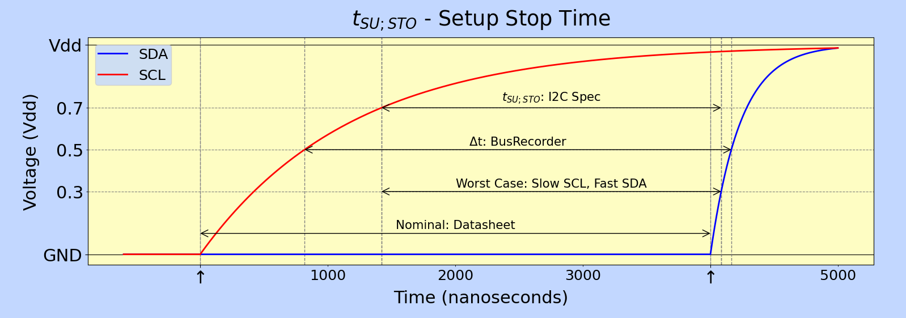

# I2C Timing on the i.MX RT1062 (Teensy 4)
The Teensy 4 is an `i.MX RT1062` processor. This document describes the
`i.MX RT1062`'s implementation of the I2C Specification. Its behaviour
is controlled by various registers.

This document defines the relationship between the timing parameters
in the I2C Specification and the `i.MX RT1062` registers. It:

* lists the `i.MX RT1062` registers that affect the parameter
* gives equations to calculate the parameter from the registers
* shows the difference between times measured with `BusRecorder`
  and the I2C Specification

Other documents cover the `i.MX RT1062` [pin configuration](pin_configuration.md)
and the [actual values](default_i2c_profile.md) for the I2C parameters
used in this driver.

# Table of Contents
TODO: Add ToC

# References
## i.MX RT1062
Information on the i.MX RT1062 is taken from the datasheet;
[i.MX RT1060 Processor Reference Manual, Rev. 3 - 07/2021](../references/IMXRT1060RM_rev3.pdf).
References to this datasheet are given like this `47.5.1.24 Slave Configuration 2 (SCFGR2)`.

Relevant sections:
* `Chapter 47 - Low Power Inter-Integrated Circuit (LPI2C)`

## I2C Specification
Details of the I2C Specification are taken from the spec itself.
[I2C-bus specification and user manual Rev. 6 - 4 April 2014](../references/UM10204.v6.pdf)
References to the spec are given like this
`I2C Spec. 3.1 Standard-mode, Fast-mode and Fast-mode Plus I2C-bus protocols`.

There is a more [recent version of the spec](../references/UM10204.v7.pdf).
The only significant difference is that v7 replaces the terms "master" and "slave"
for "controller" and "target". I've decided to keep using the old terms as
they're so widely used.

# Symbols and Units
All durations are given in nanoseconds (ns). Be warned that the
I2C Specification uses a mix of microseconds (μs) and nanoseconds.

All symbols are taken from the I2C Specification except for those defined in
this section.

## Symbols from the Datasheet
* SCL_RISETIME
  - the time for SCL line to rise from 0 to the CPU's detection voltage
  - the units are LPI2C clock cycles
  - see [When the i.MX RT1062 Detects Edges](#when-the-imx-rt1062-detects-edges)
    for a definition of the detection voltage (it's approx 0.5 Vdd)
* SDA_RISETIME
  - the time for SDA line to rise from 0 to the CPU's detection voltage
  - the units are LPI2C clock cycles
  - see [When the i.MX RT1062 Detects Edges](#when-the-imx-rt1062-detects-edges)
    for a definition of the detection voltage (it's approx 0.5 Vdd)

## Additional Symbols
The following symbols are not defined in either the I2C Specification or the datasheet.
* trH - time for signal to rise from 0 to 0.7 Vdd
    - for an RC curve this = 1.421 tr
* trL - time for signal to rise from 0 to 0.3 Vdd
    - for an RC curve this = 0.421 tr
* tfH - time for signal to fall from Vdd to 0.7 Vdd
    - for an RC curve this = 0.421 tf
* tfL - time for signal to fall from Vdd to 0.3 Vdd
    - for an RC curve this = 1.421 tf
* tLPI2C - period of the LPI2C functional clock on the `i.MX RT1062`
* tSCL - period of the SCL clock. Equal to the inverse of the clock frequency = 1/fSCL
* SCALE - scaling factor applied to I2C register values

Where it's necessary to specify the rise or fall time for a specific line
then the line is given in a suffix. So trH;SCL is the time
for SCL to rise from GND to Vdd.

# Measuring and Comparing Durations
The I2C Specification allows devices to detect edges anywhere between
0.3 Vdd and 0.7 Vdd. They *must* see the voltage
as LOW below 0.3 Vdd and HIGH above 0.7 Vdd.

This means different devices perceive the intervals between events differently.
Each device experiences a slightly different interval to one given in the
I2C Specification.

This diagram shows the I2C Specification definition of tSU;DAT
and how it may appear to the Teensy, the BusRecorder and a couple of
hypothetical devices.

## How the I2C Specification Specifies Durations
When the I2C Specification specifies the time between 2 edges, it defines
the voltages at which the duration begins and ends. For example,
tHD;STA begins when SDA falls to 0.3 Vdd and
ends when SCL falls to 0.7 Vdd. You need to take account
of this if you measure an interval with an oscilloscope.

## How the Datasheet Defines Durations
Section `47.3.1.4 Timing Parameters` of the datasheet contains equations
that derive I2C Specification timing values from the register values
used to configure the `i.MX RT1062`. e.g. tHD;STA

These calculations are somewhat misleading. They appear to give the durations
that are defined in the I2C Specification, but they don't. The difference is
that the start and end of the durations are the points at which the CPU
changes a pin value. For example, for tSU;STO, the start is the
moment that SCL is released and starts to rise. The end is the point at which
SDA is released and starts to rise.

Similarly, the rise times used in the calculations are not equal to the I2C
Specification definitions. Instead, they are the time at which the CPU detects
an edge.

I'll describe the datasheet times as the "Datasheet Nominal" times. They are
shown on graphs as "Nominal: Datasheet".

The sections below contain the equations needed to map from nominal times to
I2C Specification times.

The datasheet takes a pragmatic approach that can be implemented and is not
affected by weird rise curves. The conversion equations assume that the rise
and fall times follow perfect RC curves.

## How the BusRecorder Measures Durations
The [BusRecorder](https://github.com/Richard-Gemmell/i2c-underneath/blob/main/documentation/tools/bus_recorder/bus_recorder.md)
is a tool from the [i2c-underneath](https://github.com/Richard-Gemmell/i2c-underneath) project.
It records the time between successive edges, but they're not quite the same
intervals as the I2C Specification.

This is because the `BusRecorder` fires when the voltage passes through 0.5 Vdd.
If you configure its pins to use hysteresis then it actually fires a little
to either side of 0.5 Vdd.

This difference is very significant if the rise times are large or very
different for SDA and SCL.

| Pin Mode       | Hysteresis | Edge     | Detected At                  | Value for Teensy |
|----------------|------------|----------|------------------------------|------------------|
| INPUT          | No         | Rising   | 0.5 Vdd           | 1.650 V          |
| INPUT          | No         | Falling  | 0.5 Vdd           | 1.650 V          |
| INPUT_DISABLE  | Yes        | Rising   | 0.5 Vdd + 0.125 V | 1.775 V          |
| INPUT_DISABLE  | Yes        | Falling  | 0.5 Vdd - 0.125 V | 1.525 V          |

## How I2CTimingAnalyser Reports Durations
The [I2CTimingAnalyser](https://github.com/Richard-Gemmell/i2c-underneath/blob/main/src/analysis/i2c_timing_analyser.h)
class analyses traces recorded by the `BusRecorder`. The results include the various
timings defined in the I2C Specification.

The `I2CTimingAnalyser` compensates for the fact that the `BusRecorder` captures
edges around 0.5 Vdd. This relies on the assumption that the rise and
fall curves are perfect RC curves. The compensation will be unrealistic if
the bus does not behave like a perfect Resistor/Capacitor.

## When the i.MX RT1062 Detects Edges
The teensy4_i2c driver enables hysteresis on the I2C pins. Its trigger voltages
are the same as the `BusRecorder` with hysteresis. i.e. 0.538 Vdd for
a rising edge and 0.462 Vdd for a falling edge.

## When Other Devices Detect Edges
As mentioned above, devices are entitle to detect edges anywhere between
0.3 Vdd and 0.7 Vdd. This means that different
devices see these intervals differently.

The I2C Specification is written to account for this. For example,
tHD;DAT has a minimum duration but no maximum. It's defined so that
different devices will see only slightly longer durations than expected.

The only exceptions to this rule are tVD;DAT and tVD;ACK.
These are defined as maximum durations starting with a falling edge on SCL.
A device can see a slightly longer duration than expected by reading the
falling edge early. As of Nov 2022, I'm not sure if this is significant or not.

# i.MX RT 1060 Registers
## LPI2C Clock
* CCM_CSCDR2 `14.7.13 CCM Serial Clock Divider Register 2 (CCM_CSCDR2)`
  - LPI2C_CLK_SEL
    - selects the base clock speed
    - 0 for pll3_sw_clk at 60 MHz clock
    - 1 for osc_clk at 24 MHz
  - LPI2C_CLK_PODF
    - LPI2C clock divider

## I2C Master Registers
* MCFGR1 `47.5.1.9 Master Configuration 1 (MCFGR1)`
  - PRESCALE
    - multiplier applied to all other master settings except FILTSDA and FILTSCL
* MCCR0 `47.5.1.13 Master Clock Configuration 0 (MCCR0)`
  - CLKLO
    - affects tlow low period of the SCL clock pulse
  - CLKHI
    - affects thigh high period of the SCL clock pulse
  - DATAVD
    - affects tHD;DAT data hold time
  - SETHOLD
    - affects tHD;STA hold time for START condition
    - affects tSU;STA setup time for repeated START condition
    - affects tSU;STO setup time for STOP condition
* MCFGR2 `47.5.1.10 Master Configuration 2 (MCFGR2)`
  - FILTSDA
    - affects tSP spike suppression on SDA line
    - not affected by PRESCALE
  - FILTSCL
    - affects tSP spike suppression on SCL line
    - not affected by PRESCALE
  - BUSIDLE
    - affects tBUF minimum bus free time between a STOP and START condition
* MCFGR3 `47.5.1.11 Master Configuration 3 (MCFGR3)`
  - PINLOW
    - configures pin low timeout
    - used to detect a stuck bus

## I2C Slave Registers
TODO: Not finished

# I2C Timing Parameters and Calculations
## Variables Defined in i.MX RT1062 Datasheet
These variables are defined in the datasheet. The datasheet uses them
as intermediate variables in the I2C timing equations.

See Table 47-6 in `47.3.2.4 Timing Parameters` for the master calculations.

### SCALE
> SCALE = (2 ^ PRESCALE) x tLPI2C

### SDA_RISETIME
Given trt(SDA) = time for SDA to rise to the trigger voltage
then the rise time in LPI2C clock cycles is
> SDA_RISETIME = tr;SDA / tLPI2C

### SCL_RISETIME
Given trt(SCL) = time for SCL to rise to the trigger voltage
then the rise time in LPI2C clock cycles is
> SCL_RISETIME = tr;SCL / tLPI2C
 
### SDA_LATENCY
> SDA_LATENCY = ROUNDDOWN ( (2 + FILTSDA + SDA_RISETIME) / (2 ^ PRESCALE) )

### SCL_LATENCY
> SCL_LATENCY = ROUNDDOWN ( (2 + FILTSCL + SCL_RISETIME) / (2 ^ PRESCALE) )

## SCL Clock Frequency
### fSCL SCL Clock Frequency
The frequency is the inverse of the period tLPI2C. I'll describe everything
in terms of the period as that's what we control and measure.

#### Equations
> nominal = (CLKHI + CLKLO + 2 + SCL_LATENCY) x scale
>
> fSCL = 1 / nominal

#### Notes
* controlled entirely by the master device
* NOT the same as adding the clock HIGH and clock LOW periods

#### I2C Specification
* starts when SCL falls to 0.3 Vdd
* ends when SCL falls to 0.3 Vdd for a second time
* specifies a maximum frequency (i.e. a minimum period)

#### Datasheet Nominal
Behaviour:
* the processor pulses SCL regularly

#### Other Device Worst Case
* the `i.MX RT1062` does not compensate for the SCL rise time
* the worst case scenario is that the SCL rise time is very fast

### tLOW LOW Period of the SCL Clock

#### Equations
> nominal = (CLKLO + 1) x scale
>
> tLOW = nominal - tfL;SCL + trL;SCL

#### Notes
* controlled entirely by the master device
* confirmed that it's not affected by:
  - FILTSCL
  - FILTSDA
  - CLKHI
  - DATAVD
  - SETHOLD
  - IOMUXC_PAD_HYS

#### I2C Specification
* starts when SCL falls to 0.3 Vdd
* ends when SCL rises to 0.3 Vdd
* defines a minimum value but not a maximum
  - this allows the bus to be slower than the nominal speed.
    e.g. running a Standard-mode bus at 50 kHz.

#### Datasheet Nominal
Behaviour:
* the processor
  * pulls SCL low
  * waits for a fixed time
  * then releases SCL again
* there's no compensation for rise or fall times

#### Other Device Worst Case
The worst case scenario is that SCL has a slow fall time and a very fast
rise time. The fall time is controlled entirely by the `i.MX RT1062`and is
very short so this isn't significant.

### tHIGH HIGH Period of the SCL Clock

#### Equations
> nominal = (CLKHI + 1 + SCL_LATENCY) * scale
>
> tHIGH = nominal - trH;SCL + tfH;SCL

#### Notes
* controlled entirely by the master device
* fall time can be neglected
* there's a minimum value but no maximum value
* confirmed that thigh is also affected by:
  * IOMUXC_PAD_HYS
* confirmed that thigh is not affected by:
  - FILTSDA
  - CLKLO
  - DATAVD
  - SETHOLD
  - BUSIDLE

#### I2C Specification
* starts when SCL rises to 0.3 Vdd
* ends when SCL falls to 0.7 Vdd
* defines a minimum value but not a maximum
  - this allows the bus to be slower than the nominal speed. e.g.
    running a Standard-mode bus at 50 kHz.

#### Datasheet Nominal
Behaviour:
* the processor
  * release SCL
  * waits for SCL to rise to the trigger voltage (just over 0.5 Vdd)
  * waits for fixed time
  * pulls SCL LOW again
* there's no compensation for the SCL fall time but this is short and can be
  neglected

#### Other Device Worst Case
The worst case scenario is that SCL has a slow rise time and a very fast
fall time. The fall time is controlled entirely by the `i.MX RT1062`and is
very short so this isn't significant.

## Start and Stop Conditions
### tSU;STA Setup Time for a Repeated START Condition

#### Equations
> nominal = (SETHOLD + 1 + SCL_LATENCY) x (2 ^ PRESCALE) x scale
>
> tSU;STA = nominal - trH;SCL + tfH;SDA

#### Notes
* controlled entirely by the master device
* fall time can be neglected
* there's a minimum value but no maximum value

#### I2C Specification
* occurs during a repeated START
  - a repeated START allows the master to send another message without sending a STOP
  - this reduces latency as there's no need for the STOP or "bus free time" periods
* starts when SCL rises to 0.7 Vdd
* ends when SDA falls to 0.7 Vdd

#### Datasheet Nominal
Behaviour:
* the processor releases the SCL pin allowing SCL to rise
* when it detects that SCL has risen it waits for a time derived from SETHOLD
  * this provides limited compensation for different rise times
* when the time has passed it pulls SDA low

Definition:
* starts when the master releases SCL and it starts to rise
  * i.e. master sets SCL pin to 1
* ends when the master pulls SDA LOW and it starts to fall
  * i.e. master sets SDA pin to 0

Sensitivity to SCL rise time:
* for a fixed SETHOLD
  - the setup time falls as the rise time increases
  - the setup time increases as FILTSCL increases

#### Other Device Worst Case
* the `i.MX RT1062` does not compensate for the whole SCL rise time
* so the worst case scenario is that the SCL rise time is very long and
  the SDA fall time is very short
* the fall time is controlled by the `i.MX RT1062` and is very short.
  This means the fall time has a negligible effect and can be ignored.

### tHD;STA Hold Time for a START or Repeated START Condition

#### Equations
> nominal = (SETHOLD + 1) x scale
>
> tHD;STA = nominal - tfL;SDA + tfH;SCL

#### Notes
* Controlled entirely by the master device.
* Fall time can be neglected.

#### I2C Specification
* occurs during a START
* starts when SDA falls to 0.3 Vdd
* ends when SCL falls to 0.7 Vdd

#### Datasheet Nominal
In theory, the fall time, tf, might affect the calculation.
In practice, it doesn't matter because this calculation is only relevant
when the Teensy is acting as a master. In that mode, the fall times are
set by the Teensy. They're very fast so they can't have any significant
effect.

#### Other Device Worst Case
* according to the datasheet, the `i.MX RT1062` does not compensate for
  the fall times of SDA or SCL
* for a particular set of register settings the worst case scenario is that
  the SDA fall time is very long and the SCL fall time is very short
* both of these edges are controlled by the `i.MX RT1062` itself and they're
  both very short (< 8 ns) and nearly identical
* it's therefore safe to ignore the worst case scenario when configuring
  the device

### tSU;STO Setup Time for STOP Condition

#### Equations
> nominal = (SETHOLD + 1 + SCL_LATENCY) x (2 ^ PRESCALE) x scale
>
> tSU;STO = nominal - trH;SCL + trL;SDA

#### Notes
* controlled entirely by the master device

Confirmed it depends on:
* PRESCALE
* SCL rise time
* FILTSCL

Confirmed it does not depend on:
* FILTSDA

#### I2C Specification
* occurs before a STOP
* starts when SCL rises to 0.7 Vdd
* ends when SDA rises 0.7 Vdd
* there's a minimum value but no maximum value

#### Datasheet Nominal
Behaviour:
* the processor releases the SCL pin allowing SCL to rise
* when it detects that SCL has risen it waits for a time derived from SETHOLD
  * this provides limited compensation for different rise times
* when the time has passed it releases SDA allowing SDA to rise

Definition:
* starts when the master releases SCL and it starts to rise
  * i.e. master sets SCL pin to 1
* ends when the master releases SDA and it starts to rise
  * i.e. master sets SDA pin to 1

Sensitivity to SCL rise time:
* for a fixed SETHOLD
  - the setup time falls as the rise time increases
  - the setup time increases as FILTSCL increases

#### Other Device Worst Case
* the `i.MX RT1062` does not compensate for the whole SCL rise time
* so the worst case scenario is that the SCL rise time is very long and
  the SDA rise time is very short

### tBUF Minimum Bus Free Time Between a STOP and START Condition

## Data Bits
### tSU;DAT Data Setup Time
#### Notes
#### I2C Specification
#### Datasheet Nominal
#### Other Device Worst Case

### tHD;DAT Data Hold Time
#### Notes
#### I2C Specification
#### Datasheet Nominal
#### Other Device Worst Case

### tVD;DAT Data Valid Time
#### Notes
#### I2C Specification
#### Datasheet Nominal
#### Other Device Worst Case

## ACKs and Spikes
### tVD;ACK Data Valid Acknowledge Time
#### Notes
#### I2C Specification
#### Datasheet Nominal
#### Other Device Worst Case

### tSP Pulse Width of Spikes that must be Suppressed by the Input Filter
#### Notes
#### I2C Specification
#### Datasheet Nominal

~~~~~~~~
#### Notes
#### I2C Specification
#### Datasheet Nominal
