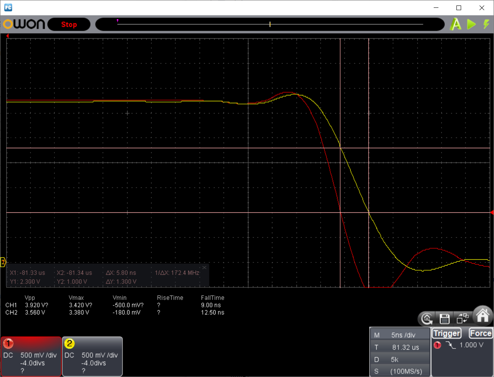

# Observations and Measurements

# Teensy 4 Loopback
## Test Configuration
* Master - Teensy 4 I2C port 0
* Slave - Teensy 4 I2C port 1 on the same device
* SCL connected to pin 22
* SDA connected to pin 23
* Owon VDS 1022 25 MHz oscilloscope hooked on to pins 22 and 23
* Measurements taken with oscilloscope unless stated otherwise

## Findings
### Fall Time (tf)
According to the I2C specification, the fall time is the time taken for
a line to fall from 0.7 Vdd to 0.3 Vdd. This is
called tf in the spec.

* SCL fall time approx 4 ns
* SDA fall time approx 6 ns

### Hold Time (tHD;DAT)
See image for fall times.
* minimum approx 5 ns

### Rise Time (tr)
According to the I2C specification, the rise time is the time taken for
a line to rise from 0.3 Vdd to 0.7 Vdd. This is
called tr in the spec.

* SCL fall time approx 320 ns
* SDA fall time approx 320 ns

